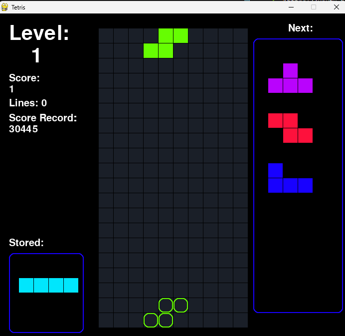

# Tetris


[](https://youtu.be/T2Y66yXCxRI)


## ¿Cómo correr el programa?

 Hay 3 formas de correr el programa:
 
 1. El más sencillo seria ir a la carpeta dist y hacer doble click en el archivo ```main.exe```, esto hara correr el juego
 1. Si esto por algun motivo no llegar a funcionar puede correr el mismo archivo desde la consola estando dentro de la carpeta base Tetris, y ejecutando el comando
       ``` .\dist\main.exe ```
1. Y la ultima opción seria ejecutando el archivo main.py, pero para eso debe tener las librerias instalados que se encuentran en la sección "Librerias usadas"


## Liberías usadas

* pygame
* sys
* random
* copy
